# ERD

## 1. 개요

### 1. 목적

이 문서는 VeilGram의 데이터베이스 구조를 정의하는 ERD(Entity-Relationship Diagram)를 설명합니다. 각 ERD는 필요한 데이터 모델을 시각적으로 표현합니다.

## 2. 전체 ERD 목록

```mermaid
erDiagram
    USERS {
        UUID     id             PK
        datetime created_at
        datetime last_active
    }
    PROFILES {
        UUID     id             PK
        UUID     user_id        FK
        varchar  nickname
        text     status_message
        datetime created_at
        datetime updated_at
    }

    POSTS {
        UUID     id          PK
        UUID     author_id   FK
        text     content
        UUID     poll_id     FK
        datetime created_at
        datetime updated_at
    }
    MEDIA {
        UUID        id          PK
        UUID        post_id     FK
        enum        type
        string      url
        datetime    created_at
    }
    POLLS {
        UUID        id          PK
        datetime    created_at
        datetime    updated_at
    }
    POLL_OPTIONS {
        UUID    id          PK
        UUID    poll_id     FK
        varchar option_text
    }
    VOTES {
        UUID        id              PK
        UUID        poll_option_id  FK
        UUID        user_id         FK
        datetime    created_at
    }
    REPOSTS {
        UUID        id                  PK
        UUID        user_id             FK
        UUID        original_post_id    FK
        datetime    created_at
    }
    COMMENTS {
        UUID        id          PK
        UUID        post_id     FK
        UUID        user_id     FK
        UUID        parent_id   FK
        text        content
        datetime    created_at
        datetime    updated_at
    }

    POST_LIKES {
        UUID        id          PK
        UUID        post_id     FK
        UUID        user_id     FK
        datetime    created_at
    }
    COMMENT_LIKES {
        UUID        id          PK
        UUID        comment_id  FK
        UUID        user_id     FK
        datetime    created_at
    }
    BOOKMARKS {
        UUID        id          PK
        UUID        user_id     FK
        UUID        post_id     FK
        datetime    created_at
    }

    FOLLOWS {
        UUID        id              PK
        UUID        follower_id     FK
        UUID        following_id    FK
        datetime    created_at
    }
    BLOCKS {
        UUID        id              PK
        UUID        user_id         FK
        UUID        blocked_user_id FK
        datetime    created_at
    }
    USER_REPORTS {
        UUID        id              PK
        UUID        reporter_id     FK
        UUID        target_user_id  FK
        text        reasons
        datetime    created_at
    }
    POST_REPORTS {
        UUID        id          PK
        UUID        reporter_id FK
        UUID        post_id     FK
        text        reasons
        boolean     block
        datetime    created_at
    }
    COMMENT_REPORTS {
        UUID        id          PK
        UUID        reporter_id FK
        UUID        comment_id  FK
        text        reasons
        boolean     block
        datetime    created_at
    }

    HASHTAGS {
        UUID    id      PK
        varchar name
    }
    POST_HASHTAGS {
        UUID    id          PK
        UUID    post_id     FK
        UUID    hashtag_id  FK
    }

    DEVICES {
        UUID        id              PK
        UUID        user_id         FK
        string      device_token
        datetime    created_at
    }

    NOTIFICATION_SETTINGS {
        UUID        id          PK
        UUID        user_id     FK
        boolean     follow
        boolean     post
        boolean     comment
        boolean     like
        datetime    updated_at
    }
    NOTIFICATIONS {
        UUID        id          PK
        UUID        user_id     FK
        enum        type
        json        payload
        boolean     is_read
        datetime    created_at
    }

    AUDIT_LOGS {
        UUID        id          PK
        UUID        user_id     FK
        enum        action
        varchar     target_type
        UUID        target_id
        datetime    created_at
    }

    USERS ||--|| PROFILES               : has
    USERS ||--o{ POSTS                  : writes
    USERS ||--o{ COMMENTS               : writes
    USERS ||--o{ REPOSTS                : reposts
    USERS ||--o{ POST_LIKES             : likes
    USERS ||--o{ COMMENT_LIKES          : likes
    USERS ||--o{ BOOKMARKS              : bookmarks
    USERS ||--o{ FOLLOWS                : follows
    USERS }o--o{ BLOCKS                 : blocks
    USERS ||--o{ USER_REPORTS           : reports_user
    USERS ||--o{ POST_REPORTS           : reports_post
    USERS ||--o{ COMMENT_REPORTS        : reports_comment
    USERS ||--o{ DEVICES                : registers
    USERS ||--|| NOTIFICATION_SETTINGS  : has
    USERS ||--o{ NOTIFICATIONS          : receives
    USERS ||--o{ AUDIT_LOGS             : logs

    POSTS ||--o{ MEDIA                  : contains
    POSTS ||--o{ POST_LIKES             : liked_by
    POSTS ||--o{ POST_REPORTS           : reported
    POSTS ||--o{ BOOKMARKS              : bookmarked_by
    POSTS ||--o{ POST_HASHTAGS          : tagged
    POSTS ||--o{ REPOSTS                : reposted_by
    POSTS ||--o{ COMMENTS               : has
    POSTS }o--|| POLLS                  : has_poll

    POLLS ||--o{ POLL_OPTIONS           : has
    POLL_OPTIONS ||--o{ VOTES           : voted
    VOTES }o--|| USERS                  : cast_by

    COMMENTS ||--o{ COMMENT_LIKES        : liked_by
    COMMENTS ||--o{ COMMENT_REPORTS      : reported
    COMMENTS ||--o{ COMMENTS             : replies

    HASHTAGS ||--o{ POST_HASHTAGS        : used_in
    POST_HASHTAGS }o--|| POSTS           : tags
```

## 3. 상세 ERD 설명

### 1. USERS

| 필드          | 타입       | 설명                                      | 제약조건 |
| ------------- | ---------- | ---------------------------------------- | -------- |
| `id`          | `UUID`     | 익명 사용자 고유 식별자 (이메일·전화번호 없이 생성된 익명 ID) | PK |
| `created_at`  | `datetime` | 계정 생성 일시 (회원가입 시 자동 기록) | Not Null |
| `last_active` | `datetime` | 마지막 활동 일시 (로그인/활동 시 갱신되어 비활성 계정 관리에 활용) | Not Null |

### 2. PROFILES

| 필드             | 타입       | 설명                            | 제약조건 |
| ---------------- | ---------- | ------------------------------- | -------- |
| `id`             | `UUID`     | 프로필 고유 식별자 (자동 생성되는 PK) | PK |
| `user_id`        | `UUID`     | 소유자 사용자 식별자 (`users.id` 참조) | FK |
| `nickname`       | `varchar`  | 사용자 설정 닉네임 (중복 검사·차단어 필터링) | Not Null |
| `status_message` | `text`     | 사용자 상태 메시지 (프로필 설명) | Nullable |
| `created_at`     | `datetime` | 프로필 생성 일시 (가입 시 자동 기록) | Not Null |
| `updated_at`     | `datetime` | 프로필 수정 일시 (닉네임/상태 메시지 변경 시 갱신) | Not Null |

### 3. POSTS

| 컬럼 이름    | 데이터 타입 | 설명                                           | 제약 조건    |
| ------------ | ---------- | --------------------------------------------- | ------------ |
| `id`         | `UUID`     | 게시물 고유 식별자 | PK, Not Null, Default `gen_random_uuid()` |
| `author_id`  | `UUID`     | 작성자(`USERS.id`)의 식별자 | FK, Not Null |
| `content`    | `text`     | 게시물의 본문 텍스트 | Not Null |
| `poll_id`    | `UUID`     | (선택) 투표 기능이 붙은 경우 연결되는 `POLLS.id` | Foreign Key, Nullable |
| `created_at` | `datetime` | 레코드 생성 시각 | Not Null, Default `NOW()` |
| `updated_at` | `datetime` | 레코드 최종 수정 시각 | Not Null, Default `NOW()`, `ON UPDATE NOW()` |

### 4. MEDIA

| 컬럼 이름     | 데이터 타입 | 설명                         | 제약 조건                                  |
| ------------ | ---------- | ---------------------------- | ----------------------------------------- |
| `id`         | `UUID`     | 미디어 고유 식별자 | PK, Not Null, Default `gen_random_uuid()` |
| `post_id`    | `UUID`     | 연관된 게시물 식별자 | FK, Not Null |
| `type`       | `enum`     | 미디어 타입 (예: `image`, `video`) | Not Null |
| `url`        | `string`   | 미디어 파일 저장소 URL | Not Null |
| `created_at` | `datetime` | 레코드 생성 시각 | Not Null, Default `NOW()` |

### 5. POLLS

| 컬럼 이름     | 데이터 타입 | 설명         | 제약 조건                                     |
| ------------ | ---------- | ------------ | -------------------------------------------- |
| `id`         | `UUID`     | 투표 고유 식별자 | PK, Not Null, Default `gen_random_uuid()` |
| `created_at` | `datetime` | 레코드 생성 시각 | Not Null, Default `NOW()` |
| `updated_at` | `datetime` | 레코드 최종 수정 시각 | Not Null, Default `NOW()`, `ON UPDATE NOW()` |

### 6. POLL_OPTIONS

| 컬럼 이름      | 데이터 타입 | 설명      | 제약 조건                                  |
| ------------- | --------- | ---------- | ----------------------------------------- |
| `id`          | `UUID`    | 선택지 고유 식별자 | PK, Not Null, Default `gen_random_uuid()` |
| `poll_id`     | `UUID`    | 소속 투표 식별자 | FK, Not Null |
| `option_text` | `varchar` | 선택지 텍스트 | Not Null |

### 7. VOTES

| 컬럼 이름         | 데이터 타입 | 설명                           | 제약 조건                                  |
| ---------------- | ---------- | ------------------------------ | ----------------------------------------- |
| `id`             | `UUID`     | 투표 기록 고유 식별자 | PK, Not Null, Default `gen_random_uuid()` |
| `poll_option_id` | `UUID`     | 선택된 옵션 식별자 (`POLL_OPTIONS.id`) | FK, Not Null |
| `user_id`        | `UUID`     | 투표한 사용자 식별자 (`USERS.id`) | FK, Not Null |
| `created_at`     | `datetime` | 투표 시각 (레코드 생성 시각) | Not Null, Default `NOW()` |

### 8. REPOSTS

| 컬럼 이름          | 데이터 타입 | 설명                           | 제약 조건                                  |
| ----------------- | ---------- | ------------------------------ | ----------------------------------------- |
| `id`              | `UUID`     | 리포스트 고유 식별자 | PK, Not Null, Default `gen_random_uuid()` |
| `user_id`         | `UUID`     | 리포스트를 요청한 사용자 식별자 (`USERS.id`) | FK, Not Null |
| `original_post_id` | `UUID`     | 원본 게시물 식별자 (`POSTS.id`) | FK, Not Null |
| `created_at`      | `datetime` | 리포스트 생성 시각 (레코드 생성 시각) | Not Null, Default `NOW()` |

### 9. COMMENTS

| 컬럼 이름     | 데이터 타입 | 설명                    | 제약 조건                                     |
| ------------ | ---------- | ----------------------- | -------------------------------------------- |
| `id`         | `UUID`     | 댓글 고유 식별자 | PK, Not Null, Default `gen_random_uuid()` |
| `post_id`    | `UUID`     | 해당 댓글이 속한 게시물 식별자 | FK, Not Null |
| `user_id`    | `UUID`     | 댓글 작성자 사용자 식별자 | FK, Not Null |
| `parent_id`  | `UUID`     | 상위 댓글 식별자 (대댓글인 경우) | FK, Nullable |
| `content`    | `text`     | 댓글 본문 | Not Null |
| `created_at` | `datetime` | 댓글 작성 시각 (레코드 생성 시각) | Not Null, Default `NOW()` |
| `updated_at` | `datetime` | 댓글 수정 시각 (레코드 최종 수정 시각) | Not Null, Default `NOW()`, `ON UPDATE NOW()` |

### 10. POST_LIKES

| 컬럼 이름     | 데이터 타입 | 설명             | 제약 조건                                  |
| ------------ | ---------- | ---------------- | ----------------------------------------- |
| `id`         | `UUID`     | 좋아요 고유 식별자 | PK, Not Null, Default `gen_random_uuid()` |
| `post_id`    | `UUID`     | 좋아요가 연결된 게시물 식별자 | FK, Not Null |
| `user_id`    | `UUID`     | 좋아요를 누른 사용자 식별자 | FK, Not Null |
| `created_at` | `datetime` | 좋아요 생성 시각 | Not Null, Default `NOW()` |

### 11. COMMENT_LIKES

| 컬럼 이름     | 데이터 타입 | 설명            | 제약 조건                                  |
| ------------ | ---------- | --------------- | ----------------------------------------- |
| `id`         | `UUID`     | 댓글 좋아요 고유 식별자 | PK, Not Null, Default `gen_random_uuid()` |
| `comment_id` | `UUID`     | 좋아요가 연결된 댓글 식별자 | FK, Not Null |
| `user_id`    | `UUID`     | 좋아요를 누른 사용자 식별자 | FK, Not Null |
| `created_at` | `datetime` | 좋아요 생성 시각 | Not Null, Default `NOW()` |

### 12. BOOKMARKS

| 컬럼 이름     | 데이터 타입 | 설명             | 제약 조건                                  |
| ------------ | ---------- | ---------------- | ----------------------------------------- |
| `id`         | `UUID`     | 북마크 고유 식별자 | PK, Not Null, Default `gen_random_uuid()` |
| `user_id`    | `UUID`     | 북마크를 생성한 사용자 식별자 | FK, Not Null |
| `post_id`    | `UUID`     | 북마크된 게시물 식별자 | FK, Not Null |
| `created_at` | `datetime` | 북마크 생성 시각 | Not Null, Default `NOW()` |

### 13. FOLLOWS

| 컬럼 이름       | 데이터 타입 | 설명             | 제약 조건                                  |
| -------------- | ---------- | ---------------- | ----------------------------------------- |
| `id`           | `UUID`     | 팔로우 관계 고유 식별자 | PK, Not Null, Default `gen_random_uuid()` |
| `follower_id`  | `UUID`     | 팔로우를 요청한 사용자 식별자 | FK, Not Null |
| `following_id` | `UUID`     | 팔로우 대상 사용자 식별자 | FK, Not Null |
| `created_at`   | `datetime` | 팔로우 생성 시각 | Not Null, Default `NOW()` |

### 14. BLOCKS

| 컬럼 이름          | 데이터 타입 | 설명            | 제약 조건                                  |
| ----------------- | ---------- | --------------- | ----------------------------------------- |
| `id`              | `UUID`     | 차단 관계 고유 식별자 | PK, Not Null, Default `gen_random_uuid()` |
| `user_id`         | `UUID`     | 차단을 요청한 사용자 식별자 | FK, Not Null |
| `blocked_user_id` | `UUID`     | 차단된 대상 사용자 식별자 | FK, Not Null |
| `created_at`      | `datetime` | 차단 생성 시각 | Not Null, Default `NOW()` |

### 15. USER_REPORTS

| 컬럼 이름         | 데이터 타입 | 설명          | 제약 조건                                  |
| ---------------- | ---------- | ------------- | ----------------------------------------- |
| `id`             | `UUID`     | 사용자 신고 고유 식별자 | PK, Not Null, Default `gen_random_uuid()` |
| `reporter_id`    | `UUID`     | 신고를 한 사용자 식별자 | FK, Not Null |
| `target_user_id` | `UUID`     | 신고 대상 사용자 식별자 | FK, Not Null |
| `reasons`        | `text`     | 신고 사유 | Not Null |
| `created_at`     | `datetime` | 신고 생성 시각 | Not Null, Default `NOW()` |

### 16. POST_REPORTS

| 컬럼 이름      | 데이터 타입 | 설명                               | 제약 조건                                  |
| ------------- | ---------- | ---------------------------------- | ----------------------------------------- |
| `id`          | `UUID`     | 게시물 신고 고유 식별자 | PK, Not Null, Default `gen_random_uuid()` |
| `reporter_id` | `UUID`     | 신고를 요청한 사용자 식별자 | FK, Not Null |
| `post_id`     | `UUID`     | 신고 대상 게시물 식별자 | FK, Not Null |
| `reasons`     | `text`     | 신고 사유 | Not Null |
| `block`       | `boolean`  | 신고 처리 시 해당 게시물 차단 여부 (true일 경우 차단) | Not Null, Default `false` |
| `created_at`  | `datetime` | 신고 생성 시각 | Not Null, Default `NOW()` |

### 17. COMMENT_REPORTS

| 컬럼 이름      | 데이터 타입 | 설명                           | 제약 조건                                  |
| ------------- | ---------- | ------------------------------ | ----------------------------------------- |
| `id`          | `UUID`     | 댓글 신고 고유 식별자 | PK, Not Null, Default `gen_random_uuid()` |
| `reporter_id` | `UUID`     | 신고를 요청한 사용자 식별자 | FK, Not Null |
| `comment_id`  | `UUID`     | 신고 대상 댓글 식별자 | FK, Not Null |
| `reasons`     | `text`     | 신고 사유 | Not Null |
| `block`       | `boolean`  | 신고 처리 시 댓글 차단 여부 (`true`이면 차단) | Not Null, Default `false` |
| `created_at`  | `datetime` | 신고 생성 시각 | Not Null, Default `NOW()` |

### 18. HASHTAGS

| 컬럼 이름 | 데이터 타입 | 설명              | 제약 조건                                  |
| ------ | --------- | -------------------- | ----------------------------------------- |
| `id`   | `UUID`    | 해시태그 고유 식별자 | PK, Not Null, Default `gen_random_uuid()` |
| `name` | `varchar` | 해시태그 텍스트 (‘#’ 없이 저장) | Not Null, Unique |

### 19. POST_HASHTAGS

| 컬럼 이름     | 데이터 타입 | 설명                   | 제약 조건                                  |
| ------------ | ------ | -------------------------- | ----------------------------------------- |
| `id`         | `UUID` | 매핑 관계 고유 식별자 (게시물-해시태그 연결) | PK, Not Null, Default `gen_random_uuid()` |
| `post_id`    | `UUID` | 연결된 게시물 식별자 | FK, Not Null |
| `hashtag_id` | `UUID` | 연결된 해시태그 식별자 | FK, Not Null |

### 20. DEVICES

| 컬럼 이름       | 데이터 타입 | 설명                 | 제약 조건                                  |
| -------------- | ---------- | -------------------- | ----------------------------------------- |
| `id`           | `UUID`     | 디바이스 고유 식별자 | PK, Not Null, Default `gen_random_uuid()` |
| `user_id`      | `UUID`     | 해당 디바이스를 등록한 사용자 식별자 | FK, Not Null |
| `device_token` | `string`   | 푸시 알림 전송을 위한 디바이스 토큰 | Not Null |
| `created_at`   | `datetime` | 레코드 생성 시각 | Not Null, Default `NOW()` |

### 21. NOTIFICATION_SETTINGS

| 컬럼 이름     | 데이터 타입 | 설명           | 제약 조건                                     |
| ------------ | ---------- | -------------- | -------------------------------------------- |
| `id`         | `UUID`     | 알림 설정 고유 식별자 | PK, Not Null, Default `gen_random_uuid()` |
| `user_id`    | `UUID`     | 설정 대상 사용자 식별자 | FK (`USERS.id`), Not Null |
| `follow`     | `boolean`  | 팔로우 알림 수신 여부 | Not Null |
| `post`       | `boolean`  | 새 게시물 알림 수신 여부 | Not Null |
| `comment`    | `boolean`  | 댓글 알림 수신 여부 | Not Null |
| `like`       | `boolean`  | 좋아요 알림 수신 여부 | Not Null |
| `updated_at` | `datetime` | 설정 최종 수정 시각 | Not Null, Default `NOW()`, `ON UPDATE NOW()` |

### 22. NOTIFICATIONS

| 컬럼 이름     | 데이터 타입 | 설명                       | 제약 조건                       |
| ------------ | ---------- | -------------------------- | ------------------------------ |
| `id`         | `UUID`     | 알림 고유 식별자 | PK, Not Null, Default `gen_random_uuid()` |
| `user_id`    | `UUID`     | 알림 수신 대상 사용자 식별자 | FK, Not Null |
| `type`       | `enum`     | 알림 유형 (예: `follow`, `comment`, `like`, `post`) | Not Null |
| `payload`    | `json`     | 알림 관련 추가 데이터 (ex. 링크, 메시지 등) | Not Null |
| `is_read`    | `boolean`  | 읽음 여부 | Not Null, Default `false` |
| `created_at` | `datetime` | 알림 생성 시각 | Not Null, Default `NOW()` |

### 23. AUDIT_LOGS

| 컬럼 이름      | 데이터 타입 | 설명            | 제약 조건                                  |
| ------------- | ---------- | --------------- | ----------------------------------------- |
| `id`          | `UUID`     | 로그 고유 식별자 | PK, Not Null, Default `gen_random_uuid()` |
| `user_id`     | `UUID`     | 액션을 수행한 사용자 식별자 | FK (`USERS.id`), Not Null |
| `action`      | `enum`     | 수행된 액션 유형 (예: `login`, `create_post`, `delete_comment`) | Not Null |
| `target_type` | `varchar`  | 로그 대상 엔티티 타입 (예: `post`, `comment`) | Not Null |
| `target_id`   | `UUID`     | 로그 대상 엔티티 식별자 | Not Null |
| `created_at`  | `datetime` | 로그 생성 시각 | Not Null, Default `NOW()` |

## 4. 상세 ERD 참고 사항

### 1. UNIQUE 제약 조건

| 테이블 이름              | UNIQUE 제약 컬럼               |
| ----------------------- | ----------------------------- |
| `PROFILES`              | `user_id`, `nickname`         |
| `DEVICES`               | `device_token`                |
| `NOTIFICATION_SETTINGS` | `user_id`                     |
| `HASHTAGS`              | `name`                        |
| `REPOSTS`               | `user_id`, `original_post_id` |
| `POST_LIKES`            | `(user_id, post_id)`          |
| `COMMENT_LIKES`         | `(user_id, comment_id)`       |
| `BOOKMARKS`             | `(user_id, post_id)`          |
| `FOLLOWS`               | `(follower_id, following_id)` |
| `BLOCKS`                | `(user_id, blocked_user_id)`  |
| `POLL_OPTIONS`          | `(poll_id, option_text)`      |
| `POST_HASHTAGS`         | `(post_id, hashtag_id)`       |

## 5. 상세 relationship 설명

| 관계 이름                     | 주체 테이블      | 대상 테이블              | 카디널리티   | 설명                                                |
| ---------------------------- | --------------- | ----------------------- | ----------- | --------------------------------------------------- |
| Users–Profiles               | `users`         | `profiles`              | 1:1         | 회원 가입 시 프로필이 자동 생성되며 각 프로필은 하나의 사용자만을 참조 |
| Users–Posts                  | `users`         | `posts`                 | 1\:N        | 한 명의 사용자는 여러 개의 게시물 작성 가능 |
| Users-Reposts                | `users`         | `reposts`               | 1\:N        | 한 명의 사용자는 여러 게시물 리포스트 가능 |
| Users–Comments               | `users`         | `comments`              | 1\:N        | 한 명의 사용자는 여러 개의 댓글 작성 가능 |
| Users–Post\_Likes            | `users`         | `post_likes`            | 1\:N        | 한 명의 사용자는 여러 게시물에 좋아요 가능 |
| Users–Comment\_Likes         | `users`         | `comment_likes`         | 1\:N        | 한 명의 사용자는 여러 댓글에 좋아요 가능 |
| Users–Bookmarks              | `users`         | `bookmarks`             | 1\:N        | 한 명의 사용자는 여러 게시물 북마크 가능 |
| Users–Follows                | `users`         | `follows`               | 1\:N        | 한 명의 사용자는 여러 다른 사용자 팔로우 가능 |
| Users–Blocks                 | `users`         | `blocks`                | M\:N        | 사용자는 여러 사용자를 차단할 수 있고 한 사용자도 여러 사용자에게 차단 가능 |
| Users–User\_Reports          | `users`         | `user_reports`          | 1\:N        | 한 명의 사용자는 여러 사용자 신고 가능 |
| Users–Post\_Reports          | `users`         | `post_reports`          | 1\:N        | 한 명의 사용자는 여러 게시물 신고 가능 |
| Users–Comment\_Reports       | `users`         | `comment_reports`       | 1\:N        | 한 명의 사용자는 여러 댓글 신고 가능 |
| Users–Devices                | `users`         | `devices`               | 1\:N        | 한 명의 사용자는 여러 디바이스 등록 가능 |
| Users–Notification\_Settings | `users`         | `notification_settings` | 1:1         | 각 사용자는 하나의 알림 설정 레코드 소유 |
| Users–Notifications          | `users`         | `notifications`         | 1\:N        | 한 명의 사용자는 여러 알림 수령 가능 |
| Users–Audit\_Logs            | `users`         | `audit_logs`            | 1\:N        | 한 명의 사용자는 여러 활동 로그 생성 가능 |
| Posts–Media                  | `posts`         | `media`                 | 1\:N        | 한 게시물에 여러 이미지/동영상 첨부 가능 |
| Posts–Post\_Likes            | `posts`         | `post_likes`            | 1\:N        | 한 게시물은 여러 사용자의 좋아요 대상 가능 |
| Posts–Post\_Reports          | `posts`         | `post_reports`          | 1\:N        | 한 게시물은 여러 신고 대상 가능 |
| Posts–Bookmarks              | `posts`         | `bookmarks`             | 1\:N        | 한 게시물은 여러 사용자의 북마크 대상 가능 |
| Posts–Post\_Hashtags         | `posts`         | `post_hashtags`         | 1\:N        | 한 게시물은 여러 해시태그와 연결 가능 |
| Posts–Reposts                | `posts`         | `reposts`               | 1\:N        | 한 게시물은 여러 사용자의 리포스트 대상 가능 |
| Posts–Comments               | `posts`         | `comments`              | 1\:N        | 한 게시물에 여러 댓글 연결 가능 |
| Posts–Polls                  | `posts`         | `polls`                 | 1:1         | 게시물당 최대 하나의 투표 부착 가능 |
| Polls–Poll\_Options          | `polls`         | `poll_options`          | 1\:N        | 한 투표에 여러 선택지 존재 |
| Poll\_Options–Votes          | `poll_options`  | `votes`                 | 1\:N        | 하나의 선택지에 여러 사용자가 투표 가능 |
| Votes–Users                  | `votes`         | `users`                 | N:1         | 한 사용자는 여러 투표 기록 존재 가능 |
| Comments–Comment\_Likes      | `comments`      | `comment_likes`         | 1\:N        | 한 댓글은 여러 사용자의 좋아요 대상 가능 |
| Comments–Comment\_Reports    | `comments`      | `comment_reports`       | 1\:N        | 한 댓글은 여러 신고 대상 가능 |
| Comments–Replies             | `comments`      | `comments`              | 1\:N        | 댓글은 대댓글을 통해 자기 자신과 계층 관계 |
| Hashtags–Post\_Hashtags      | `hashtags`      | `post_hashtags`         | 1\:N        | 하나의 해시태그는 여러 게시물에 사용 가능 |
| Post\_Hashtags–Posts         | `post_hashtags` | `posts`                 | N:1         | 여러 매핑 레코드가 한 게시물에 연결 가능 |
