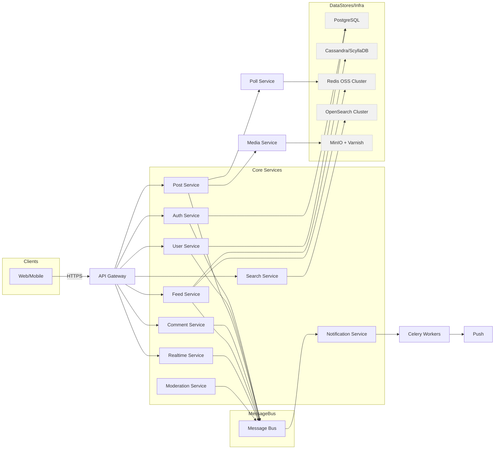

# 아키텍처 다이어그램

## 1. 개요

### 1. 목적

이 문서는 VeilGram의 아키텍처 설계를 위한 다이어그램을 제공합니다. 시스템의 구조와 주요 컴포넌트를 시각적으로 표현하여 개발자와 이해관계자가 시스템을 이해하는 데 도움을 줍니다.

## 2. 시스템 구성도

## 3. 시스템 구성도 설명

### 1. 목차

1. API Gateway
2. Core Services
    1. Auth Service
    2. User Service
    3. Post Service
    4. Comment Service
    5. Feed Service
    6. Realtime Service
    7. Moderation Service
    8. Search Service
    9. Notification Service
3. Media Service
4. Poll Service
5. Message Bus
    1. Apache Kafka
    2. RabbitMQ
    3. Redis Pub/Sub
6. Data Stores
    1. PostgreSQL
    2. Cassandra/ScyllaDB
    3. Redis OSS Cluster
    4. OpenSearch Cluster
    5. MinIO + Varnish
7. Celery Workers

### 2. 설명

1. API Gateway
    - 목적
        - 클라이언트와 내부 서비스의 단일 진입점
        - TLS 종료, JWT 검증을 Auth Proxy 에 위임, Rate Limiting, CORS, 공통 로깅·모니터링 처리
    - 역할
        - HTTP(S) 요청 및 WebSocket 핸드셰이크 프록시
        - `/auth`, `/posts`, `/search`, `/ws` 등 경로 기반 라우팅
        - 정책(Hash-based IP 차단, Quota 등) 적용
    - 선택 근거
        - Kubernetes-native: Helm으로 간편 배포·관리
        - 이벤트 기반 NGINX: 다수 동시 연결과 TLS 처리를 효율적으로 처리
        - 운영 부담 최소화: Managed Gateway 대비 저비용, 벤더 중립
2. Core Services
    1. Auth Service
        - 목적
            - 익명 사용자 인증 및 세션 관리
            - PII 최소화: 이메일·전화 없이 UUID 기반 익명 인증
        - 역할
            - Access/Refresh JWT 토큰 발급 및 검증
            - Token Rotation, 블랙리스트 관리
        - 선택 근거
            - 무상태: 서버 세션 저장 불필요 → 수평 확장 용이
            - P99 < 300ms, 초당 수만 건 인증 처리 목표 부합
            - 클레임에 sub=user_id만 담아 PII 유출 리스크 최소화
    2. User Service
        - 목적
            - 닉네임·상태 메시지 등 프로필 CRUD
            - 불건전 닉네임 필터링, 중복 체크, 비활성 계정 관리
        - 역할
            - PostgreSQL 액세스: ACID 보장
            - 필터링 로직(욕설·스팸), 탈퇴 시 데이터 정리
        - 선택 근거
            - 관계형 DB의 일관성 강화 필요 기능에 적합
            - Django ORM과 마이그레이션 지원으로 개발 속도 ↑
            - PII를 다루지 않는 단순 프로필 모델로 설계
    3. Post Service
        - 목적
            - 텍스트·이미지·동영상·투표 포함한 게시물 관리
        - 역할
            - CRUD API, 미디어 서비스에 업로드 위임, Poll Service 호출
            - 이벤트 발행: Message Bus → Feed/Notification/Moderation
        - 선택 근거
            - 단일 책임 원칙: 게시물 로직 집중
            - DRF 채택으로 일관된 스키마·검증 제공
            - 미디어·투표 로직 분리로 유지보수성·스케일링 최적화
    4. Comment Service
        - 목적
            - 댓글·대댓글 CRUD, 좋아요 집계, 신고
        - 역할
            - CRUD API, 계층적 모델
            - 좋아요·신고 이벤트 발행 → Message Bus → Notification/Moderation
        - 선택 근거
            - 댓글 트래픽·모델 복잡도 분리
            - 별도 스케일링 및 장애 격리로 안정성 확보
            - 독립 배포·테스트로 개발 효율화
    5. Feed Service
        - 목적
            - 팔로우·인기·해시태그 피드 생성 및 서빙
        - 역할
            - 피드 조합 로직, 캐시 관리
            - 신규 피드 이벤트 구독 후 캐시 무효화/재생성
        - 선택 근거
            - Redis OSS Cluster: P99 < 300ms 응답 보장
            - Cassandra/ScyllaDB: 사용자별 샤딩으로 무한 확장
            - 최종 일관성 허용 영역에 최적화
    6. Realtime Service
        - 목적
            - 클라이언트 실시간 UI 업데이트
        - 역할
            - Django Channels + Redis Pub/Sub으로 세션 관리
            - Feed 이벤트 수신 후 해당 연결로 푸시
        - 선택 근거
            - HTTP 워커와 분리된 비동기 이벤트 루프
            - Persistent Connection 격리로 API 성능 저하 방지
            - API Gateway 프록시 통해 단일 호스트 UX 유지
    7. Moderation Service
        - 목적
            - 텍스트·이미지 NSFW/욕설/스팸 자동 필터링
        - 역할
            - Message Bus 구독
            - 머신러닝 모델·키워드 검사
            - 차단·경고 결과 발행
        - 선택 근거
            - 비동기 처리로 원본 API 응답 지연 최소화
            - 독립 배포로 필터링 규칙·모델 업데이트 용이
            - 메시지 보존으로 장애 복구 시 재처리 지원
    8. Search Service
        - 목적
            - 사용자·게시물·해시태그 검색 기능 제공
        - 역할
            - 인덱스 관리, 데이터 동기화
            - 복합 쿼리(부분 일치, 정렬, 페이징 등) 처리
        - 선택 근거
            - OpenSearch: Elasticsearch OSS fork, 라이선스 자유
            - 텍스트 검색·집계 최적화된 분산 인프라
            - API Gateway 통해 일관된 보안·로깅 적용
    9. Notification Service
        - 목적
            - 앱 푸시·인앱 알림 전송
        - 역할
            - Bus 구독
            - Celery Workers → FCM/APNs 호출
            - 실패 재시도·Dead-letter 처리
        - 선택 근거
            - 비동기 워커로 대량 알림도 안정 처리
            - 메시지 기반 확장성: Bus와 독립적 스케일링
            - 실시간 연결 없는 환경에서도 보장
3. Media Service
    - 목적
        - 대용량 이미지·동영상 저장 및 캐싱 제공
    - 역할
        - MinIO: S3 API 호환 오브젝트 스토리지
        - Varnish/NGINX: HTTP 캐싱
        - 업로드 후 인코딩·썸네일 작업은 Celery 처리
    - 선택 근거
        - 오픈소스 기반 비용 최소화
        - HTTP 캐싱으로 P99 응답시간 단축
        - S3 호환 API로 코드 변경 최소화
4. Poll Service
    - 목적
        - 게시물 내 투표 실시간 집계 및 결과 제공
    - 역할
        - Redis 인메모리 카운터로 집계
        - 주기적 영속화 → Cassandra 저장
    - 선택 근거
        - Redis Pub/Sub과 결합해 즉시 반영
        - 단순 카운팅 로직 분리로 Post Service 경량화
        - 최종 일관성에 맞춘 설계
5. Message Bus
    1. Apache Kafka
        - 목적
            - 대규모 이벤트 스트리밍, 이벤트 소싱
        - 역할
            - Feed 생성·로그 수집, 재생 가능한 이벤트 로그
        - 선택 근거
            - 고내구성·순서 보장·파티셔닝 기반 초고속 처리
    2. RabbitMQ
        - 목적
            - 복잡한 라우팅, 작업 큐
        - 역할
            - 이미지 인코딩, 이메일 알림, RPC 스타일 통신
        - 선택 근거
            - Exchange 패턴으로 세밀 라우팅·Ack/Nack·DLX 지원
    3. Redis Pub/Sub
        - 목적
            - 실시간 알림 브로드캐스트, 캐시 무효화 신호
        - 역할
            - WebSocket/SSE 푸시, Feed/Cache 갱신
        - 선택 근거
            - 인메모리 초저지연, 간편 구성
6. Data Stores
    1. PostgreSQL
        - 목적
            - 인증 및 사용자 프로필 데이터의 ACID 트랜잭션을 보장
        - 역할
            - 사용자 가입·로그인 정보, 닉네임·상태 메시지 등의 저장
            - 계정 탈퇴 시 일괄 삭제 또는 마스킹
        - 선택 근거
            - Django ORM과 마이그레이션 지원으로 개발 생산성 향상
            - 관계형 스키마로 복잡한 쿼리와 조인 처리에 적합
            - 트랜잭션 일관성이 중요한 Auth/Profile 도메인에 최적
    2. Cassandra/ScyllaDB
        - 목적
            - 팔로우 피드 및 카운트 데이터 같은 대용량 분산 저장
        - 역할
            - 사용자별·파티션별로 샤딩된 피드 항목 및 좋아요/댓글 수 집계 저장
        - 선택 근거
            - 쓰기 집중 워크로드에 최적화된 LSM 기반 아키텍처
            - 노드 추가만으로 용량·처리량 선형 확장 가능
            - 최종 일관성을 허용하는 피드 도메인 특성에 부합
    3. Redis OSS Cluster
        - 목적
            - 세션 관리, 피드/검색 캐시, 실시간 Pub/Sub, 투표 집계
        - 역할
            - HTTP 세션 토큰 저장
            - Feed Service 캐시 스냅샷 및 Cache Invalidation 신호
            - Realtime Service 및 Poll Service의 Pub/Sub 채널 제공
        - 선택 근거
            - 인메모리 기반으로 수십 μs 단위 응답 시간 보장
            - Sentinel/Cluster 모드로 HA 구성 가능
            - 이미 캐시·세션 용도로 도입 시 추가 인프라 부담 최소
    4. OpenSearch Cluster
        - 목적
            - 사용자·게시물·해시태그 검색 인덱싱 및 질의 처리
        - 역할
            - CRUD 이벤트 수신 후 색인 → 복합 검색(부분 일치, 정렬·페이징 등) API 제공
        - 선택 근거
            - Elasticsearch OSS 포크로 라이선스 우려 없음
            - 분산 인덱스·집계 기능으로 대용량 텍스트 검색에 최적
            - Kibana 호환 대시보드 활용 가능
    5. MinIO + Varnish
        - 목적
            - 대용량 이미지·동영상 오브젝트 저장 및 HTTP 캐싱 제공
        - 역할
            - MinIO: S3 호환 오브젝트 저장소
            - Varnish: CDN 대체 HTTP 캐시로 P99 응답시간 단축
        - 선택 근거
            - 오픈소스 기반으로 비용 절감
            - S3 API 호환으로 코드·라이브러리 변경 최소화
            - Varnish 캐시 전략으로 글로벌 CDN 없이도 지연 시간 최적화
7. Celery Workers
    - 목적
        - 비동기 백그라운드 작업 처리
    - 역할
        - Notification, Media 인코딩, 데이터 영속화
    - 선택 근거
        - 워커 풀 형태로 확장 가능
        - 실패 재시도 정책으로 안정성 확보

## 4. 기타 구성

### 1. Infra & 운영 도구

1. Kubernetes
    - 목적
        - 컨테이너화된 서비스의 오케스트레이션 및 리소스 관리
        - 무중단 배포·자가 치유로 높은 가용성 달성
    - 역할
        - 컨테이너 스케줄링: 각 서비스를 적절한 노드에 스케줄
        - 서비스 디스커버리 & 네트워킹: ClusterIP, Ingress, DNS를 통해 내부/외부 통신 관리
        - 헬스체크 & 리스타트: Liveness/Readiness Probe로 장애 시 자동 재시작
        - 오토스케일링:
            - Horizontal Pod Autoscaler로 CPU/RAM/커스텀 메트릭 기반 자동 수평 확장
            - Cluster Autoscaler로 노드 풀 자동 확장·축소
        - 롤링 업데이트 & 롤백: Deployment 단위로 무중단 새 버전 배포
    - 선택 근거
        - 컨테이너 오케스트레이션 분야 사실상의 표준으로, 커뮤니티·생태계가 풍부
        - 선언적 매니페스트로 인프라 일관성 관리・버전 관리 용이
        - 자체 복구 기능, Autoscaling, 네임스페이스 격리 등 운영 효율성 극대화
        - 온프레미스·클라우드·하이브리드 전반에 걸쳐 동일한 운영 경험 보장
2. CI/CD
    - 목적
        - 코드 변경 → 빌드 → 테스트 → 배포까지 완전 자동화
        - 품질(테스트 커버리지, 린팅 등)과 보안(SAST/Dependency Scan 등) 보장
    - 역할
        - GitOps 툴:
            - Git 리포지토리의 선언적 매니페스트를 클러스터 상태와 동기화
            - PR 승인 시 자동 배포, Drift 감지 후 알림
        - CI 파이프라인:
            - pytest로 단위·통합 테스트 실행
            - flake8/black으로 코드 스타일・린트 검사
            - SAST 도구(예: Bandit, Trivy)로 취약점 스캔
            - Docker 이미지 빌드 및 레지스트리 푸시
    - 선택 근거
        - GitOps 패턴으로 배포 이력·롤백이 Git 커밋 단위로 추적 가능
        - ArgoCD/Flux OSS는 무료이며, 커뮤니티가 활발해 학습·운영 자료 풍부
        - 통합 테스트·보안 스캔을 CI 단계에 포함시켜, 배포 전 문제 조기 발견
        - 분리된 CI/CD 역할로 서로 다른 팀 간 책임 경계 명확
3. 모니터링·로깅
    - 목적
        - 시스템 상태·성능 지표 실시간 모니터링
        - 로그 집계·검색·분석을 통한 장애 대응 및 트러블슈팅
    - 역할
        - Prometheus:
            - 각 서비스 및 Kubernetes 메트릭(컨테이너 CPU/RAM, 네트워크 등)을 스크랩
            - Alertmanager와 연동해 임계치 초과 시 알림
        - Grafana:
            - Prometheus 메트릭 대시보드 구성 (서비스별 RPS, 에러율, 레이턴시 등)
            - 커스텀 알림·리포트
        - EFK 스택:
            - Fluent Bit: 각 노드에서 로그 수집·전송
            - Elasticsearch: 로그 인덱스 생성·저장 → 고속 검색 가능
            - Kibana: 로그 뷰·쿼리 대시보드, 장애 시점 로그 분석
    - 선택 근거
        - Prometheus/Grafana는 CNCF 표준 모니터링 스택으로, Kubernetes와 네이티브 통합
        - Alertmanager를 통한 유연한 알림 라우팅 지원
        - EFK는 대용량 로그 저장·분석에 최적화, Kibana를 통한 직관적 조회
        - 모든 툴이 오픈소스로 비용 부담 없이 운영 가능하면서 커뮤니티 지원이 강력
