# 시퀀스 다이어그램

## 1. 개요

### 1. 목적

시퀀스 다이어그램은 시스템의 동작을 순서대로 나타내는 다이어그램으로 각 객체 간의 상호작용을 시각적으로 표현합니다. 여기서는 VeilGram 서비스의 주요 기능에 대한 시퀀스 다이어그램을 작성하여 시스템의 흐름과 상호작용을 명확히 합니다.

## 2. 주요 기능

### 1. 사용자 관리

#### 1. 회원가입

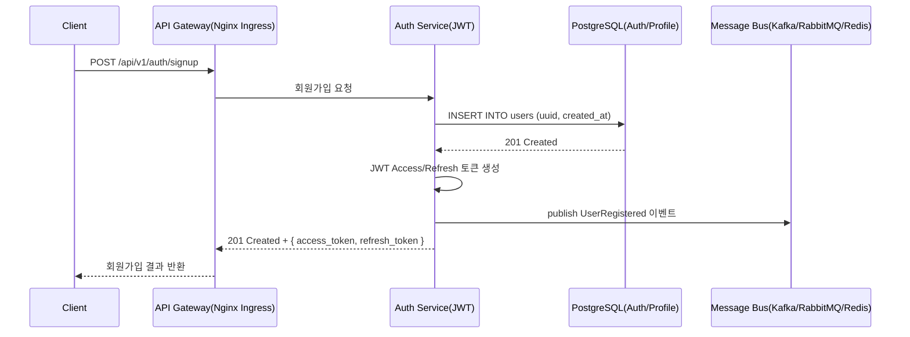

#### 2. 로그인

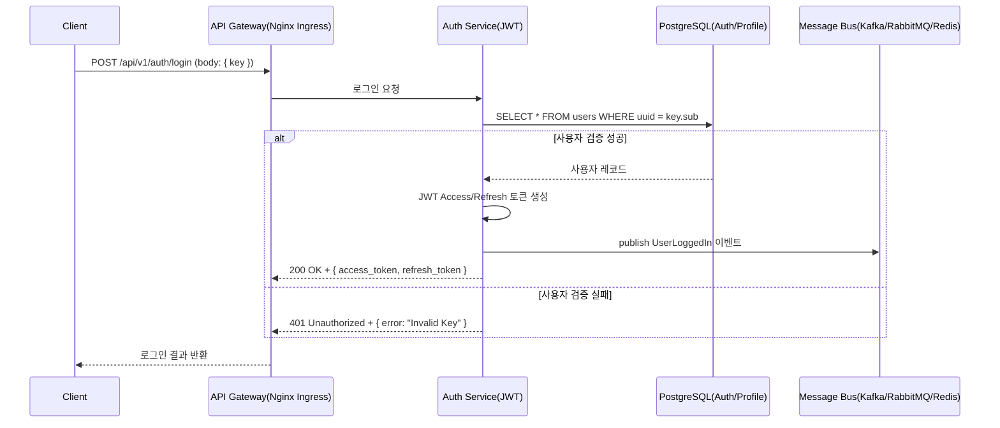

#### 3. 동시 로그인 제한

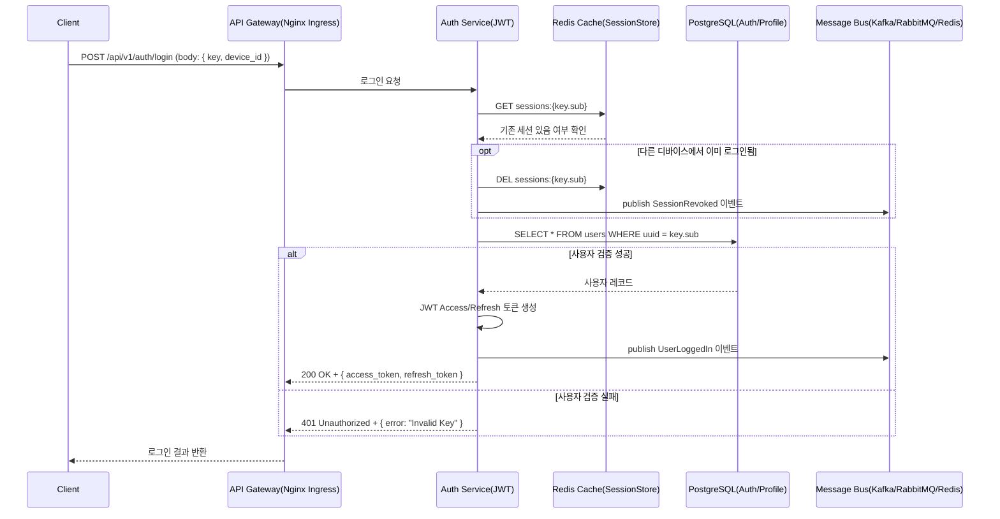

#### 4. 회원 탈퇴

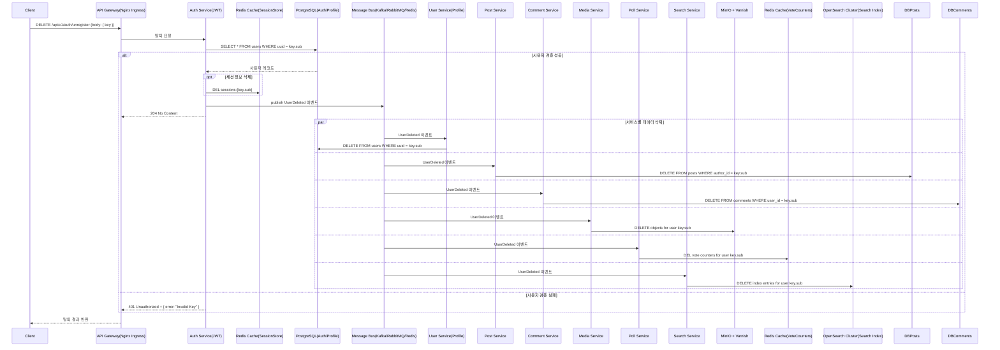

#### 5. 비활성 계정 관리

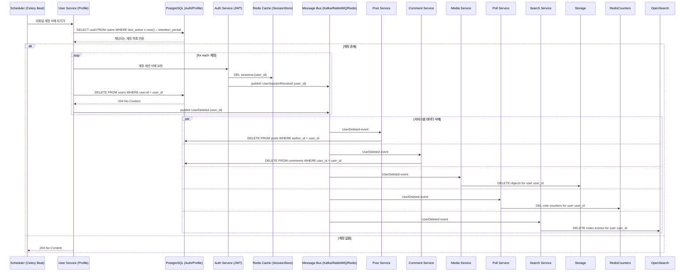

#### 6. 프로필 관리

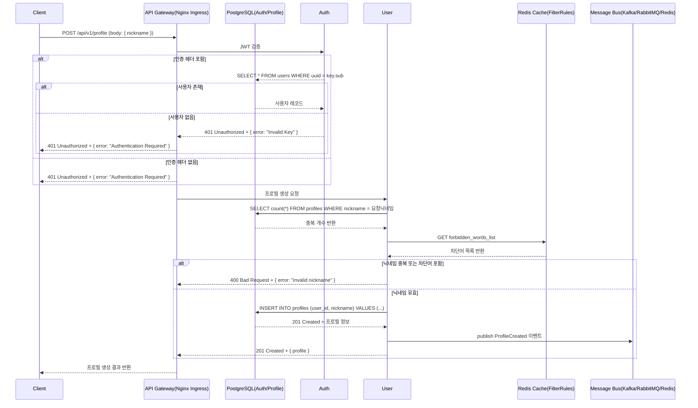

#### 7. 프로필 조회

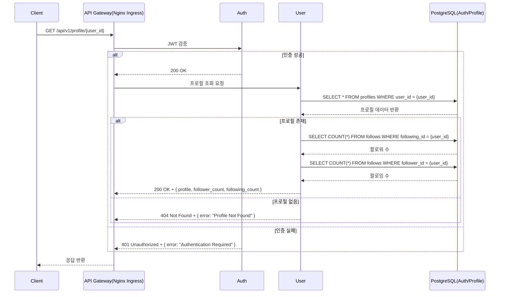

#### 8. 팔로우/언팔로우

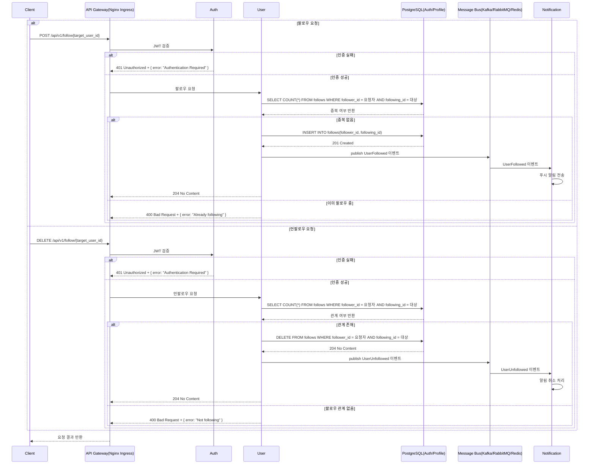

#### 9. 사용자 차단

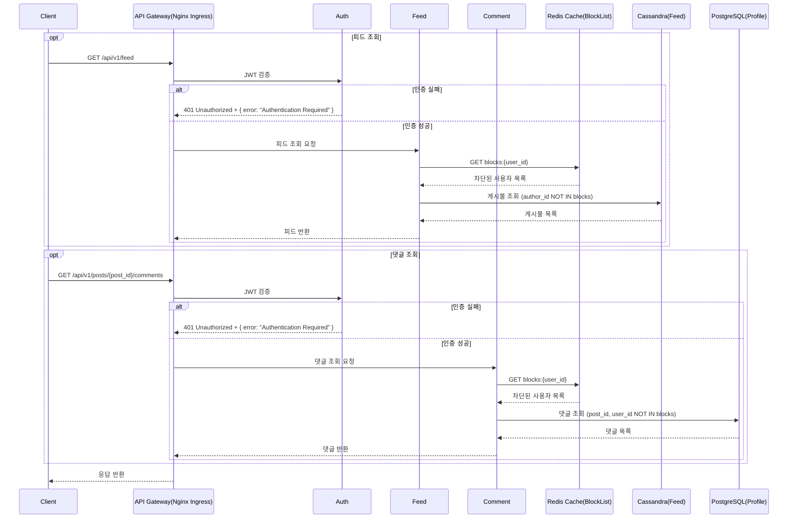

#### 10. 사용자 통계

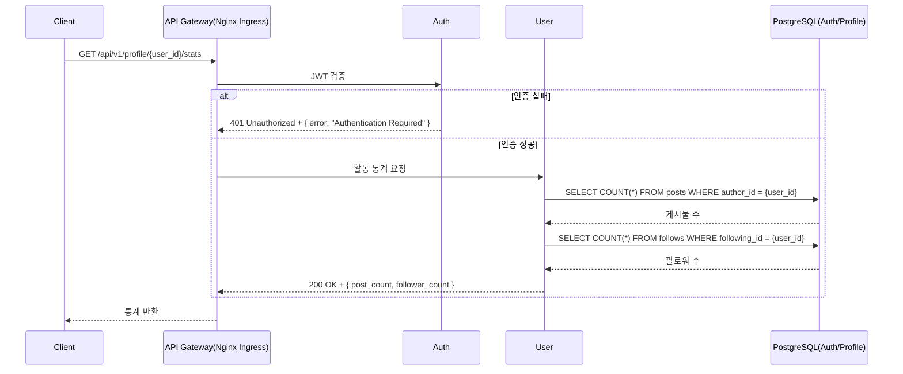

#### 11. 사용자 활동 로그

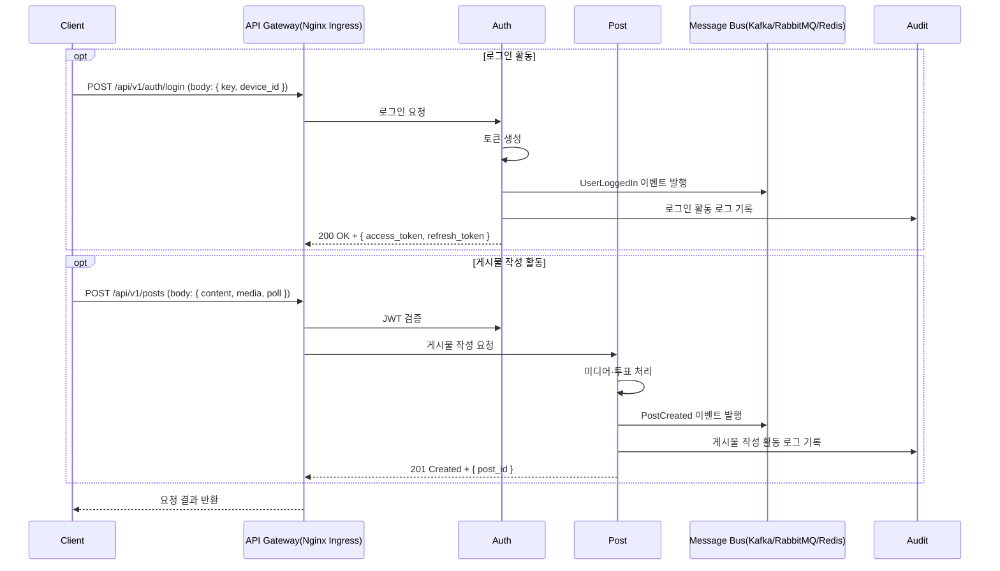

#### 12. 사용자 신고

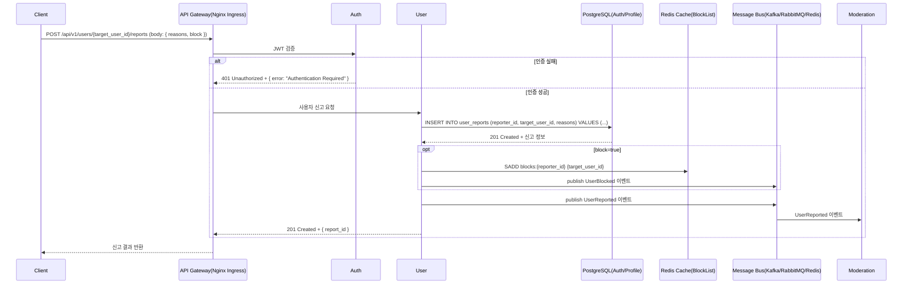

#### 13. 사용자 알림 설정

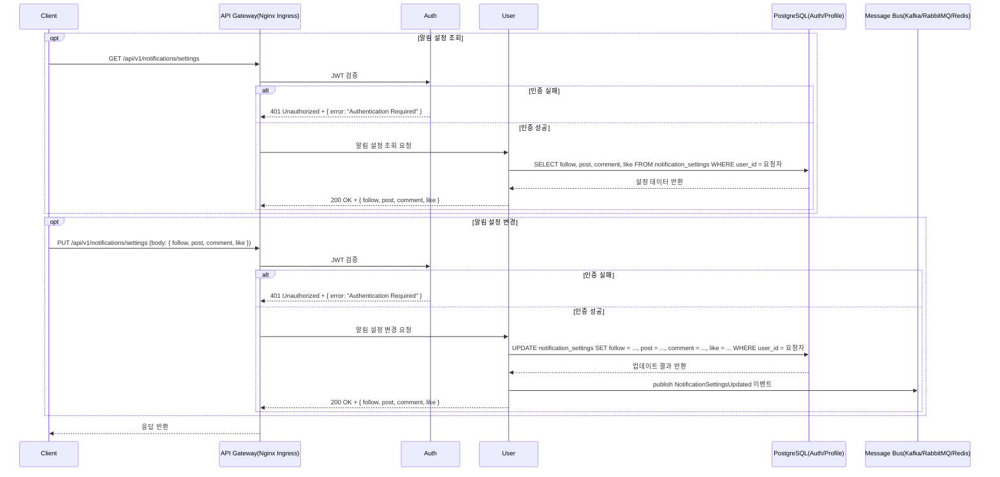

#### 14. 사용자 검색

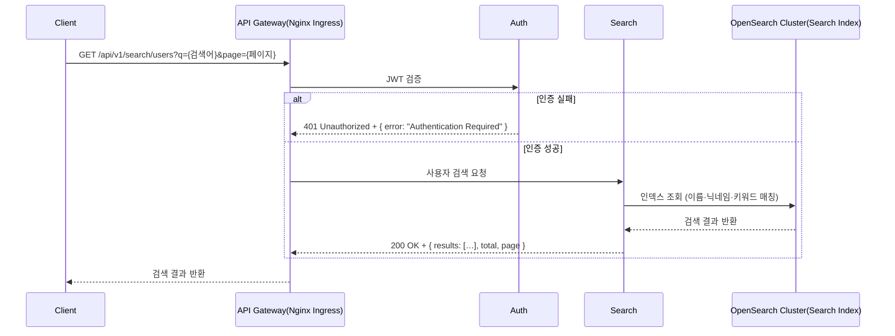

#### 15. 사용자 필터링

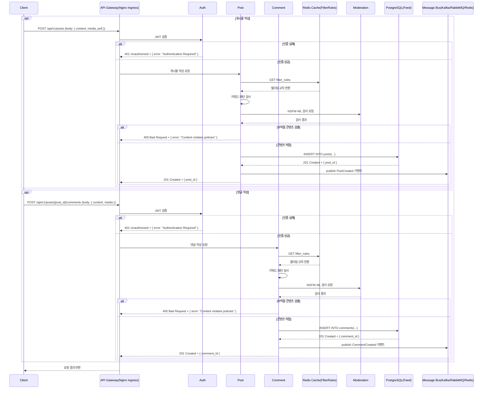

### 2. 게시물 관리

#### 1. 게시물 작성

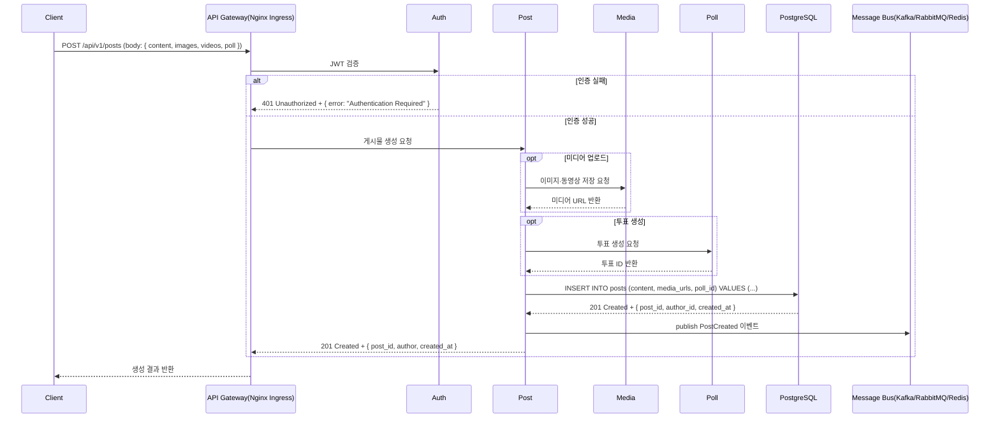

#### 2. 게시물 조회

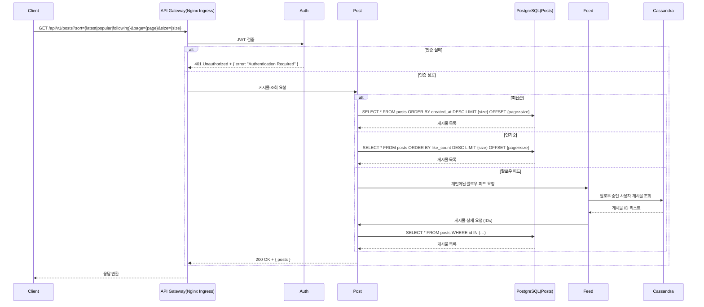

#### 3. 게시물 수정

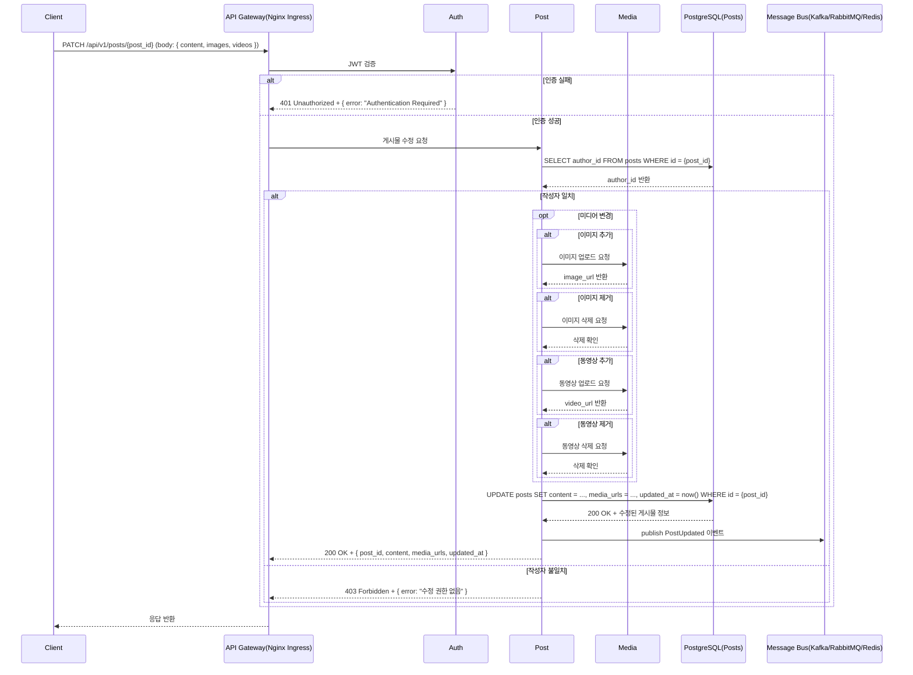

#### 4. 게시물 삭제

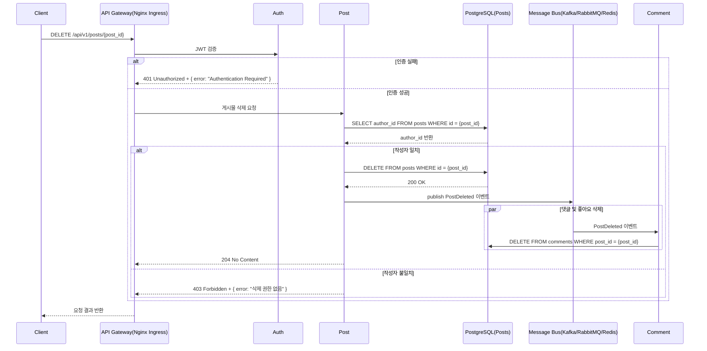

#### 5. 게시물 좋아요

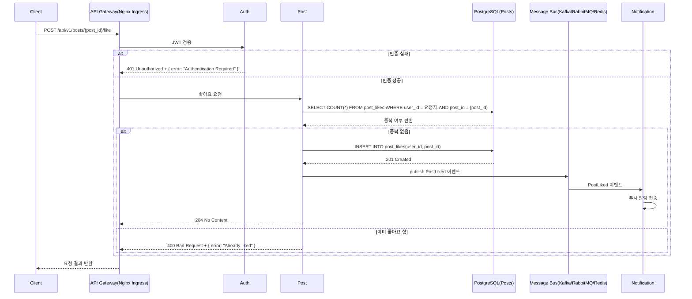

#### 6. 게시물 공유

```mermaid
sequenceDiagram
    participant Client as Client
    participant APIGW as API Gateway(Nginx Ingress)
    participant Auth as Auth
    participant Post as Post
    participant DB as PostgreSQL(Posts/Reposts)
    participant Bus as Message Bus(Kafka/RabbitMQ/Redis)
    participant Notification as Notification

    Client->>APIGW: POST /api/v1/posts/{post_id}/share
    APIGW->>Auth: JWT 검증
    alt 인증 실패
        Auth-->>APIGW: 401 Unauthorized + { error: "Authentication Required" }
    else 인증 성공
        APIGW->>Post: 공유 요청
        Post->>DB: SELECT * FROM posts WHERE id = {post_id}
        DB-->>Post: 원본 게시물 데이터 반환
        Post->>DB: INSERT INTO reposts(user_id, original_post_id, created_at) VALUES (...)
        DB-->>Post: 201 Created + { share_id }
        Post->>Bus: publish PostShared 이벤트
        Bus->>Notification: PostShared 이벤트
        Notification->>Notification: 푸시 알림 전송
        Post-->>APIGW: 201 Created + { share_id, original_post_id, sharer_id, created_at }
    end
    APIGW-->>Client: 요청 결과 반환
```

#### 7. 게시물 해시태그

```mermaid
sequenceDiagram
    participant Client as Client
    participant APIGW as API Gateway(Nginx Ingress)
    participant Auth as Auth
    participant Post as Post
    participant DB as PostgreSQL(Posts)
    participant Bus as Message Bus(Kafka/RabbitMQ/Redis)
    participant Search as Search
    participant OpenSearch as OpenSearch Cluster

    Client->>APIGW: POST /api/v1/posts (body: { content })
    APIGW->>Auth: JWT 검증
    alt 인증 실패
        Auth-->>APIGW: 401 Unauthorized + { error: "Authentication Required" }
    else 인증 성공
        APIGW->>Post: 게시물 생성 요청
        Post->>DB: INSERT INTO posts (content) VALUES (...)
        DB-->>Post: 201 Created + { post_id }
        Post->>Bus: publish PostCreated 이벤트 (post_id, content)
        opt 해시태그 추출
            Post->>Post: 텍스트에서 해시태그 추출
            Post->>Bus: publish HashtagsExtracted 이벤트 (post_id, hashtags)
        end
        Post-->>APIGW: 201 Created + { post_id }
    end
    APIGW-->>Client: 생성 결과 반환
    opt 해시태그 인덱싱
        Bus->>Search: HashtagsExtracted 이벤트 구독
        Search->>OpenSearch: 해시태그-게시물 매핑 색인
    end
```

#### 8. 게시물 북마크

```mermaid
sequenceDiagram
    participant Client as Client
    participant APIGW as API Gateway(Nginx Ingress)
    participant Auth as Auth
    participant Post as Post
    participant DB as PostgreSQL(Posts/Bookmarks)
    participant Bus as Message Bus(Kafka/RabbitMQ/Redis)

    opt 게시물 북마크 추가
        Client->>APIGW: POST /api/v1/posts/{post_id}/bookmark
        APIGW->>Auth: JWT 검증
        alt 인증 실패
            Auth-->>APIGW: 401 Unauthorized + { error: "Authentication Required" }
        else 인증 성공
            APIGW->>Post: 북마크 요청
            Post->>DB: SELECT COUNT(*) FROM bookmarks WHERE user_id = key.sub AND post_id = {post_id}
            DB-->>Post: 중복 여부 반환
            alt 중복 없음
                Post->>DB: INSERT INTO bookmarks(user_id, post_id, created_at) VALUES(...)
                DB-->>Post: 201 Created
                Post->>Bus: publish PostBookmarked 이벤트
                Post-->>APIGW: 204 No Content
            else 이미 북마크됨
                Post-->>APIGW: 400 Bad Request + { error: "Already bookmarked" }
            end
        end
    end

    opt 북마크한 게시물 조회
        Client->>APIGW: GET /api/v1/bookmarks?page={page}&size={size}
        APIGW->>Auth: JWT 검증
        alt 인증 실패
            Auth-->>APIGW: 401 Unauthorized + { error: "Authentication Required" }
        else 인증 성공
            APIGW->>Post: 북마크 목록 요청
            Post->>DB: SELECT post_id, created_at FROM bookmarks WHERE user_id = key.sub ORDER BY created_at DESC LIMIT {size} OFFSET {page*size}
            DB-->>Post: 북마크 목록 반환
            Post-->>APIGW: 200 OK + { bookmarks: […] }
        end
    end

    APIGW-->>Client: 요청 결과 반환
```

#### 9. 게시물 통계

```mermaid
sequenceDiagram
    participant Client as Client
    participant APIGW as API Gateway(Nginx Ingress)
    participant Auth as Auth
    participant Post as Post
    participant Redis as Redis Cache(ViewCounters)
    participant DB as PostgreSQL(Stats)

    Client->>APIGW: GET /api/v1/posts/{post_id}/stats
    APIGW->>Auth: JWT 검증
    alt 인증 실패
        Auth-->>APIGW: 401 Unauthorized + { error: "Authentication Required" }
    else 인증 성공
        APIGW->>Post: 통계 조회 요청
        Post->>Redis: GET views:{post_id}
        Redis-->>Post: 조회수 반환
        Post->>DB: SELECT COUNT(*) FROM post_likes WHERE post_id = {post_id}
        DB-->>Post: 좋아요 수 반환
        Post->>DB: SELECT COUNT(*) FROM comments WHERE post_id = {post_id}
        DB-->>Post: 댓글 수 반환
        Post-->>APIGW: 200 OK + { views, likes, comments }
    end
    APIGW-->>Client: 통계 반환
```

#### 10. 게시물 신고

```mermaid
sequenceDiagram
    participant Client as Client
    participant APIGW as API Gateway(Nginx Ingress)
    participant Auth as Auth
    participant Post as Post
    participant DB as PostgreSQL(Posts)
    participant Cache as Redis Cache(BlockList)
    participant Bus as Message Bus(Kafka/RabbitMQ/Redis)
    participant Moderation as Moderation

    Client->>APIGW: POST /api/v1/posts/{post_id}/reports (body: { reasons, block })
    APIGW->>Auth: JWT 검증
    alt 인증 실패
        Auth-->>APIGW: 401 Unauthorized + { error: "Authentication Required" }
    else 인증 성공
        APIGW->>Post: 게시물 신고 요청
        Post->>DB: INSERT INTO post_reports (reporter_id, post_id, reasons) VALUES (...)
        DB-->>Post: 201 Created + { report_id }
        opt block=true
            Post->>Cache: SADD blocks:{reporter_id} {author_id}
            Post->>Bus: publish UserBlocked 이벤트
        end
        Post->>Bus: publish PostReported 이벤트
        Bus->>Moderation: PostReported 이벤트
        Post-->>APIGW: 201 Created + { report_id }
    end
    APIGW-->>Client: 신고 결과 반환
```

#### 11. 게시물 필터링

```mermaid
sequenceDiagram
    participant Client as Client
    participant APIGW as API Gateway(Nginx Ingress)
    participant Auth as Auth
    participant Post as Post
    participant Cache as Redis Cache(FilterRules)
    participant Moderation as Moderation
    participant DB as PostgreSQL(Posts)
    participant Bus as Message Bus(Kafka/RabbitMQ/Redis)

    opt 게시물 작성 시 필터링
        Client->>APIGW: POST /api/v1/posts (body: { content, media, poll })
        APIGW->>Auth: JWT 검증
        alt 인증 실패
            Auth-->>APIGW: 401 Unauthorized + { error: "Authentication Required" }
        else 인증 성공
            APIGW->>Post: 게시물 작성 요청
            Post->>Cache: GET filter_rules
            Cache-->>Post: 필터링 규칙 반환
            Post->>Post: 키워드·패턴 검사
            Post->>Moderation: NSFW·ML 검사 요청
            Moderation-->>Post: 검사 결과
            alt 부적절 콘텐츠
                Post-->>APIGW: 400 Bad Request + { error: "Content violates policies" }
            else 적합
                Post->>DB: INSERT INTO posts (...)
                DB-->>Post: post_id 반환
                Post->>Bus: publish PostCreated 이벤트
                Post-->>APIGW: 201 Created + { post_id }
            end
        end
    end
    opt 게시물 수정 시 필터링
        Client->>APIGW: PATCH /api/v1/posts/{post_id} (body: { content, media })
        APIGW->>Auth: JWT 검증
        alt 인증 실패
            Auth-->>APIGW: 401 Unauthorized + { error: "Authentication Required" }
        else 인증 성공
            APIGW->>Post: 게시물 수정 요청
            Post->>DB: SELECT author_id FROM posts WHERE id = {post_id}
            DB-->>Post: author_id 반환
            alt 작성자 일치
                Post->>Cache: GET filter_rules
                Cache-->>Post: 필터링 규칙 반환
                Post->>Post: 키워드·패턴 검사
                Post->>Moderation: NSFW·ML 검사 요청
                Moderation-->>Post: 검사 결과
                alt 부적절 콘텐츠
                    Post-->>APIGW: 400 Bad Request + { error: "Content violates policies" }
                else 적합
                    Post->>DB: UPDATE posts SET content = ..., media_urls = ..., updated_at = now() WHERE id = {post_id}
                    DB-->>Post: 수정된 post_id 반환
                    Post->>Bus: publish PostUpdated 이벤트
                    Post-->>APIGW: 200 OK + { post_id }
                end
            else 작성자 불일치
                Post-->>APIGW: 403 Forbidden + { error: "수정 권한 없음" }
            end
        end
    end
    APIGW-->>Client: 요청 결과 반환
```

#### 12. 게시물 알림

```mermaid
sequenceDiagram
    participant Client as Client
    participant APIGW as API Gateway(Nginx Ingress)
    participant Auth as Auth
    participant Post as Post
    participant DB as PostgreSQL(Posts/Follow)
    participant Bus as Message Bus(Kafka/RabbitMQ/Redis)
    participant Notification as Notification

    Client->>APIGW: POST /api/v1/posts (body: { content, media, poll })
    APIGW->>Auth: JWT 검증
    alt 인증 실패
        Auth-->>APIGW: 401 Unauthorized + { error: "Authentication Required" }
    else 인증 성공
        APIGW->>Post: 게시물 작성 요청
        Post->>DB: INSERT INTO posts (...)
        DB-->>Post: 201 Created + { post_id, author_id, created_at }
        Post->>Bus: publish PostCreated 이벤트
        Post-->>APIGW: 201 Created + { post_id, author_id, created_at }
    end
    APIGW-->>Client: 생성 결과 반환
    opt 새 게시물 알림 전송
        Bus->>Notification: PostCreated 이벤트
        Notification->>DB: SELECT follower_id FROM follows WHERE following_id = author_id
        DB-->>Notification: 팔로워 목록
        loop 팔로워마다
            Notification->>Notification: 푸시 알림 전송 (follower_id)
        end
    end
```

#### 13. 게시물 검색

```mermaid
sequenceDiagram
    participant Client as Client
    participant APIGW as API Gateway(Nginx Ingress)
    participant Auth as Auth
    participant Search as Search
    participant OpenSearch as OpenSearch Cluster

    Client->>APIGW: GET /api/v1/posts/search?q={query}&page={page}&size={size}
    APIGW->>Auth: JWT 검증
    alt 인증 실패
        Auth-->>APIGW: 401 Unauthorized + { error: "Authentication Required" }
    else 인증 성공
        APIGW->>Search: 게시물 검색 요청
        Search->>OpenSearch: 인덱스 조회 (본문·해시태그 매칭)
        OpenSearch-->>Search: 검색 결과 반환
        Search-->>APIGW: 200 OK + { results, total, page }
    end
    APIGW-->>Client: 검색 결과 반환
```

### 3. 댓글 관리

#### 1. 댓글 작성

```mermaid
sequenceDiagram
    participant Client as Client
    participant APIGW as API Gateway(Nginx Ingress)
    participant Auth as Auth
    participant Comment as Comment
    participant Media as Media
    participant DB as PostgreSQL(Comments)
    participant Bus as Message Bus(Kafka/RabbitMQ/Redis)

    Client->>APIGW: POST /api/v1/posts/{post_id}/comments (body: { content, media, video })
    APIGW->>Auth: JWT 검증
    alt 인증 실패
        Auth-->>APIGW: 401 Unauthorized + { error: "Authentication Required" }
    else 인증 성공
        APIGW->>Comment: 댓글 작성 요청
        opt 미디어 첨부
            Comment->>Media: 이미지·동영상 저장 요청
            Media-->>Comment: media_url 반환
        end
        Comment->>DB: INSERT INTO comments (post_id, user_id, content, media_urls, created_at) VALUES (...)
        DB-->>Comment: 201 Created + { comment_id, author, created_at }
        Comment->>Bus: publish CommentCreated 이벤트
        Comment-->>APIGW: 201 Created + { comment_id, author, created_at }
    end
    APIGW-->>Client: 생성 결과 반환
```

#### 2. 댓글 조회

```mermaid
sequenceDiagram
    participant Client as Client
    participant APIGW as API Gateway(Nginx Ingress)
    participant Auth as Auth
    participant Comment as Comment
    participant DB as PostgreSQL(Comments)

    Client->>APIGW: GET /api/v1/posts/{post_id}/comments?sort={latest|popular}&page={page}&size={size}
    APIGW->>Auth: JWT 검증
    alt 인증 실패
        Auth-->>APIGW: 401 Unauthorized + { error: "Authentication Required" }
    else 인증 성공
        APIGW->>Comment: 댓글 조회 요청
        alt 최신순
            Comment->>DB: SELECT * FROM comments WHERE post_id = {post_id} ORDER BY created_at DESC LIMIT {size} OFFSET {page*size}
        else 인기순
            Comment->>DB: SELECT * FROM comments WHERE post_id = {post_id} ORDER BY like_count DESC LIMIT {size} OFFSET {page*size}
        end
        DB-->>Comment: 댓글 목록 반환
        Comment-->>APIGW: 200 OK + { comments }
    end
    APIGW-->>Client: 조회 결과 반환
```

#### 3. 댓글 수정

```mermaid
sequenceDiagram
    participant Client as Client
    participant APIGW as API Gateway(Nginx Ingress)
    participant Auth as Auth
    participant Comment as Comment
    participant Media as Media
    participant DB as PostgreSQL(Comments)
    participant Bus as Message Bus(Kafka/RabbitMQ/Redis)

    Client->>APIGW: PATCH /api/v1/posts/{post_id}/comments/{comment_id} (body: { content, media })
    APIGW->>Auth: JWT 검증
    alt 인증 실패
        Auth-->>APIGW: 401 Unauthorized + { error: "Authentication Required" }
    else 인증 성공
        APIGW->>Comment: 댓글 수정 요청
        Comment->>DB: SELECT author_id FROM comments WHERE id = {comment_id}
        DB-->>Comment: author_id 반환
        alt 작성자 일치
            opt 미디어 변경
                alt 이미지 추가
                    Comment->>Media: 이미지 업로드 요청
                    Media-->>Comment: image_url 반환
                end
                alt 이미지 제거
                    Comment->>Media: 이미지 삭제 요청
                    Media-->>Comment: 삭제 확인
                end
                alt 동영상 추가
                    Comment->>Media: 동영상 업로드 요청
                    Media-->>Comment: video_url 반환
                end
                alt 동영상 제거
                    Comment->>Media: 동영상 삭제 요청
                    Media-->>Comment: 삭제 확인
                end
            end
            Comment->>DB: UPDATE comments SET content = ..., media_urls = ..., updated_at = now() WHERE id = {comment_id}
            DB-->>Comment: 수정된 comment_id, updated_at 반환
            Comment->>Bus: publish CommentUpdated 이벤트
            Comment-->>APIGW: 200 OK + { comment_id, content, media_urls, updated_at }
        else 작성자 불일치
            Comment-->>APIGW: 403 Forbidden + { error: "수정 권한 없음" }
        end
    end
    APIGW-->>Client: 응답 반환
```

#### 4. 댓글 삭제

```mermaid
sequenceDiagram
    participant Client as Client
    participant APIGW as API Gateway(Nginx Ingress)
    participant Auth as Auth
    participant Comment as Comment
    participant DB as PostgreSQL(Comments)
    participant Bus as Message Bus(Kafka/RabbitMQ/Redis)

    Client->>APIGW: DELETE /api/v1/posts/{post_id}/comments/{comment_id}
    APIGW->>Auth: JWT 검증
    alt 인증 실패
        Auth-->>APIGW: 401 Unauthorized + { error: "Authentication Required" }
    else 인증 성공
        APIGW->>Comment: 댓글 삭제 요청
        Comment->>DB: SELECT author_id FROM comments WHERE id = {comment_id}
        DB-->>Comment: author_id 반환
        alt 작성자 일치
            Comment->>DB: DELETE FROM comments WHERE id = {comment_id}
            DB-->>Comment: 204 No Content
            Comment->>Bus: publish CommentDeleted 이벤트
            Comment-->>APIGW: 204 No Content
        else 작성자 불일치
            Comment-->>APIGW: 403 Forbidden + { error: "삭제 권한 없음" }
        end
    end
    APIGW-->>Client: 요청 결과 반환
```

#### 5. 대댓글

```mermaid
sequenceDiagram
    participant Client as Client
    participant APIGW as API Gateway(Nginx Ingress)
    participant Auth as Auth
    participant Comment as Comment
    participant Media as Media
    participant DB as PostgreSQL(Comments)
    participant Bus as Message Bus(Kafka/RabbitMQ/Redis)

    opt 대댓글 작성
        Client->>APIGW: POST /api/v1/posts/{post_id}/comments/{comment_id}/replies (body: { content, media })
        APIGW->>Auth: JWT 검증
        alt 인증 실패
            Auth-->>APIGW: 401 Unauthorized + { error: "Authentication Required" }
        else 인증 성공
            APIGW->>Comment: 대댓글 작성 요청
            Comment->>DB: SELECT * FROM comments WHERE id = {comment_id}
            DB-->>Comment: 부모 댓글 존재 여부 확인
            alt 부모 댓글 존재
                opt 미디어 첨부
                    Comment->>Media: 이미지·동영상 저장 요청
                    Media-->>Comment: media_url 반환
                end
                Comment->>DB: INSERT INTO comments (post_id, parent_id, user_id, content, media_urls, created_at) VALUES (...)
                DB-->>Comment: 201 Created + { reply_id, author, created_at }
                Comment->>Bus: publish CommentReplied 이벤트
                Comment-->>APIGW: 201 Created + { reply_id, author, created_at }
            else 부모 댓글 없음
                Comment-->>APIGW: 404 Not Found + { error: "Parent Comment Not Found" }
            end
        end
    end
    opt 대댓글 조회
        Client->>APIGW: GET /api/v1/posts/{post_id}/comments/{comment_id}/replies?page={page}&size={size}
        APIGW->>Auth: JWT 검증
        alt 인증 실패
            Auth-->>APIGW: 401 Unauthorized + { error: "Authentication Required" }
        else 인증 성공
            APIGW->>Comment: 대댓글 조회 요청
            Comment->>DB: SELECT * FROM comments WHERE parent_id = {comment_id} ORDER BY created_at DESC LIMIT {size} OFFSET {page*size}
            DB-->>Comment: 대댓글 목록 반환
            Comment-->>APIGW: 200 OK + { replies }
        end
    end
    APIGW-->>Client: 요청 결과 반환
```

#### 6. 댓글 좋아요

```mermaid
sequenceDiagram
    participant Client as Client
    participant APIGW as API Gateway(Nginx Ingress)
    participant Auth as Auth
    participant Comment as Comment
    participant DB as PostgreSQL(Comments/Likes)
    participant Bus as Message Bus(Kafka/RabbitMQ/Redis)
    participant Notification as Notification

    Client->>APIGW: POST /api/v1/comments/{comment_id}/like
    APIGW->>Auth: JWT 검증
    alt 인증 실패
        Auth-->>APIGW: 401 Unauthorized + { error: "Authentication Required" }
    else 인증 성공
        APIGW->>Comment: 좋아요 요청
        Comment->>DB: SELECT COUNT(*) FROM comment_likes WHERE user_id = key.sub AND comment_id = {comment_id}
        DB-->>Comment: 중복 여부 반환
        alt 중복 없음
            Comment->>DB: INSERT INTO comment_likes(user_id, comment_id)
            DB-->>Comment: 201 Created
            Comment->>Bus: publish CommentLiked 이벤트
            Bus->>Notification: CommentLiked 이벤트
            Notification->>Notification: 푸시 알림 전송
            Comment-->>APIGW: 204 No Content
        else 이미 좋아요 함
            Comment-->>APIGW: 400 Bad Request + { error: "Already liked" }
        end
    end
    APIGW-->>Client: 요청 결과 반환
```

#### 7. 댓글 신고

```mermaid
sequenceDiagram
    participant Client as Client
    participant APIGW as API Gateway(Nginx Ingress)
    participant Auth as Auth
    participant Comment as Comment
    participant DB as PostgreSQL(Comments/Reports)
    participant Cache as Redis Cache(BlockList)
    participant Bus as Message Bus(Kafka/RabbitMQ/Redis)
    participant Moderation as Moderation

    Client->>APIGW: POST /api/v1/comments/{comment_id}/reports (body: { reasons, block })
    APIGW->>Auth: JWT 검증
    alt 인증 실패
        Auth-->>APIGW: 401 Unauthorized + { error: "Authentication Required" }
    else 인증 성공
        APIGW->>Comment: 댓글 신고 요청
        Comment->>DB: INSERT INTO comment_reports (reporter_id, comment_id, reasons) VALUES (...)
        DB-->>Comment: 201 Created + 신고 정보
        opt block=true
            Comment->>Cache: SADD blocks:{reporter_id} {target_user_id}
            Comment->>Bus: publish UserBlocked 이벤트
        end
        Comment->>Bus: publish CommentReported 이벤트
        Bus->>Moderation: CommentReported 이벤트
        Comment-->>APIGW: 201 Created + { report_id }
    end
    APIGW-->>Client: 신고 결과 반환
```

#### 8. 댓글 필터링

```mermaid
sequenceDiagram
    participant Client as Client
    participant APIGW as API Gateway(Nginx Ingress)
    participant Auth as Auth
    participant Comment as Comment
    participant Cache as Redis Cache(FilterRules)
    participant Moderation as Moderation
    participant DB as PostgreSQL(Comments)

    opt 댓글 작성 시 필터링
        Client->>APIGW: POST /api/v1/posts/{post_id}/comments (body: { content, media })
        APIGW->>Auth: JWT 검증
        alt 인증 실패
            Auth-->>APIGW: 401 Unauthorized + { error: "Authentication Required" }
        else 인증 성공
            APIGW->>Comment: 댓글 작성 요청
            Comment->>Cache: GET filter_rules
            Cache-->>Comment: 필터링 규칙 반환
            Comment->>Comment: 키워드·패턴 검사
            Comment->>Moderation: NSFW·ML 검사 요청
            Moderation-->>Comment: 검사 결과
            alt 부적절 콘텐츠
                Comment-->>APIGW: 400 Bad Request + { error: "Content violates policies" }
            else 적합
                Comment->>DB: INSERT INTO comments (post_id, user_id, content, media_urls) VALUES (...)
                DB-->>Comment: 201 Created + { comment_id, author, created_at }
                Comment->>Bus: publish CommentCreated 이벤트
                Comment-->>APIGW: 201 Created + { comment_id, author, created_at }
            end
        end
    end
    opt 댓글 수정 시 필터링
        Client->>APIGW: PATCH /api/v1/posts/{post_id}/comments/{comment_id} (body: { content, media })
        APIGW->>Auth: JWT 검증
        alt 인증 실패
            Auth-->>APIGW: 401 Unauthorized + { error: "Authentication Required" }
        else 인증 성공
            APIGW->>Comment: 댓글 수정 요청
            Comment->>DB: SELECT author_id FROM comments WHERE id = {comment_id}
            DB-->>Comment: author_id 반환
            alt 작성자 일치
                Comment->>Cache: GET filter_rules
                Cache-->>Comment: 필터링 규칙 반환
                Comment->>Comment: 키워드·패턴 검사
                Comment->>Moderation: NSFW·ML 검사 요청
                Moderation-->>Comment: 검사 결과
                alt 부적절 콘텐츠
                    Comment-->>APIGW: 400 Bad Request + { error: "Content violates policies" }
                else 적합
                    Comment->>DB: UPDATE comments SET content = ..., media_urls = ..., updated_at = now() WHERE id = {comment_id}
                    DB-->>Comment: 200 OK + { comment_id, updated_at }
                    Comment->>Bus: publish CommentUpdated 이벤트
                    Comment-->>APIGW: 200 OK + { comment_id, updated_at }
                end
            else 작성자 불일치
                Comment-->>APIGW: 403 Forbidden + { error: "수정 권한 없음" }
            end
        end
    end
    APIGW-->>Client: 요청 결과 반환
```

#### 9. 댓글 알림

```mermaid
sequenceDiagram
    participant Client as Client
    participant APIGW as API Gateway(Nginx Ingress)
    participant Auth as Auth
    participant Comment as Comment
    participant DBComments as PostgreSQL(Comments)
    participant Bus as Message Bus(Kafka/RabbitMQ/Redis)
    participant Notification as Notification
    participant DBPosts as PostgreSQL(Posts)
    participant DBFollow as PostgreSQL(Profile)

    Client->>APIGW: POST /api/v1/posts/{post_id}/comments
    APIGW->>Auth: JWT 검증
    alt 인증 실패
        Auth-->>APIGW: 401 Unauthorized + { error: "Authentication Required" }
    else
        APIGW->>Comment: 댓글 작성 요청
        Comment->>DBComments: INSERT INTO comments (post_id, user_id, content, media_urls, created_at)
        DBComments-->>Comment: 201 Created + { comment_id, post_id, user_id, created_at }
        Comment->>Bus: publish CommentCreated 이벤트
        Comment-->>APIGW: 201 Created + { comment_id, author, created_at }
    end
    APIGW-->>Client: 생성 결과 반환
    opt 알림 전송
        Bus->>Notification: CommentCreated 이벤트
        Notification->>DBPosts: SELECT user_id FROM posts WHERE id = {post_id}
        DBPosts-->>Notification: post_author_id
        Notification->>Notification: 푸시 알림 전송 (post_author_id)
        Notification->>DBFollow: SELECT follower_id FROM follows WHERE following_id = post_author_id
        DBFollow-->>Notification: [follower_id…]
        loop for each follower_id
            Notification->>Notification: 푸시 알림 전송 (follower_id)
        end
    end
```
