# 시퀀스 다이어그램

## 1. 개요

### 1. 목적

시퀀스 다이어그램은 시스템의 동작을 순서대로 나타내는 다이어그램으로 각 객체 간의 상호작용을 시각적으로 표현합니다. 여기서는 VeilGram 서비스의 주요 기능에 대한 시퀀스 다이어그램을 작성하여 시스템의 흐름과 상호작용을 명확히 합니다.

## 2. 주요 기능

### 1. 사용자 관리

#### 1. 회원가입

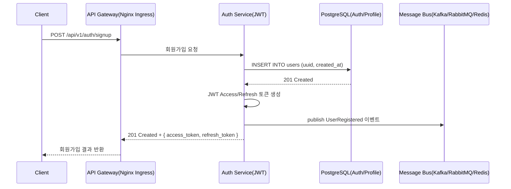

#### 2. 로그인

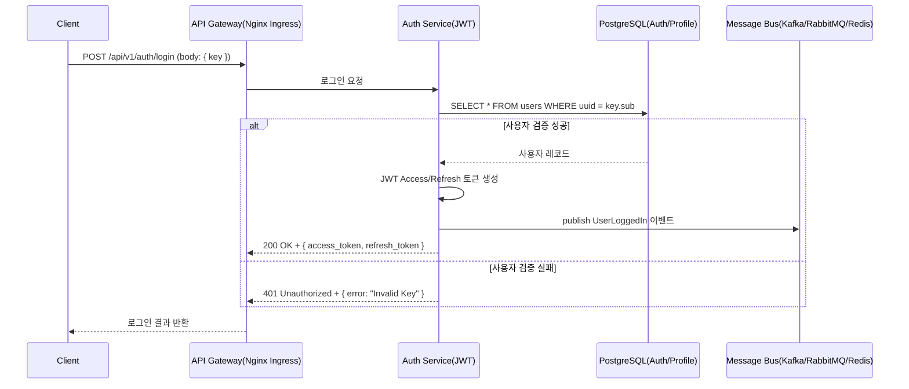

#### 3. 동시 로그인 제한

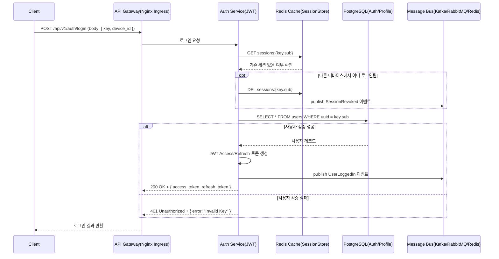

#### 4. 회원 탈퇴

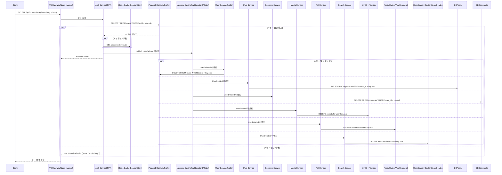

#### 5. 비활성 계정 관리

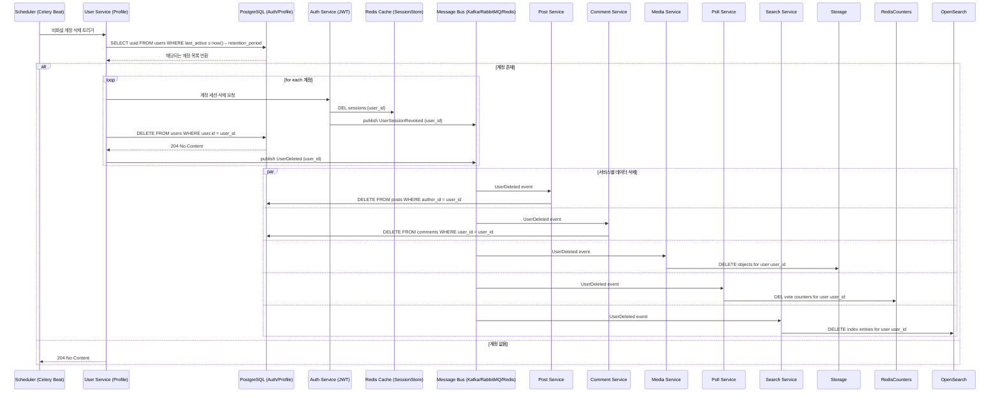

#### 6. 프로필 관리

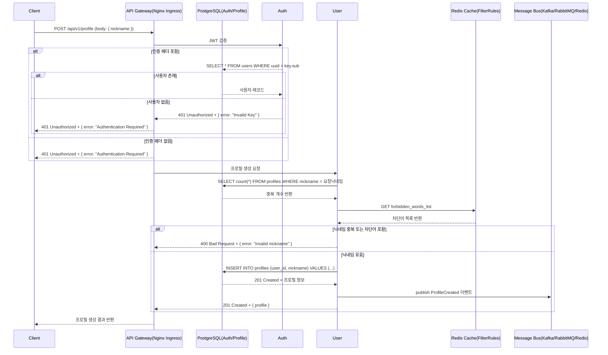

#### 7. 프로필 조회

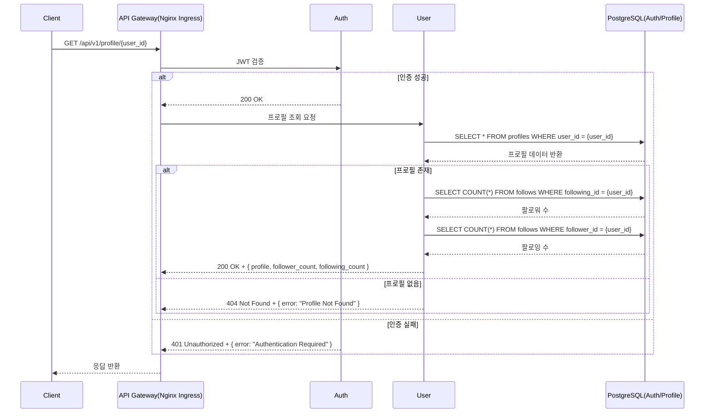

#### 8. 팔로우/언팔로우

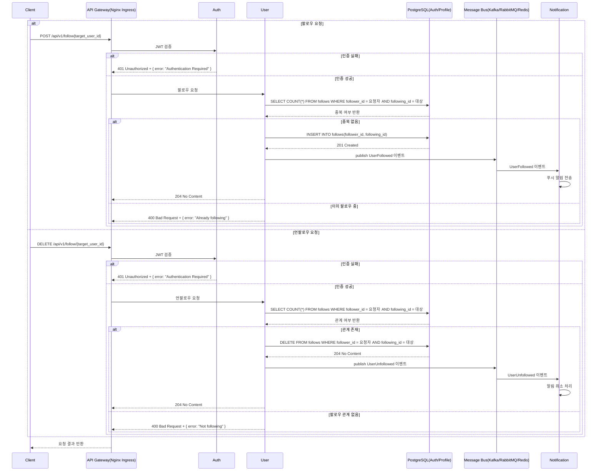

#### 9. 사용자 차단

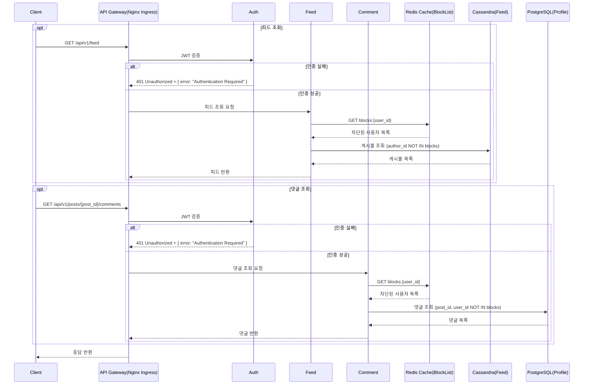

#### 10. 사용자 통계

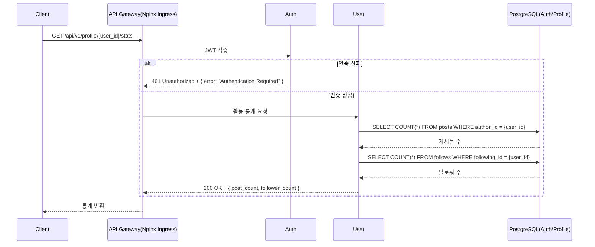

#### 11. 사용자 활동 로그

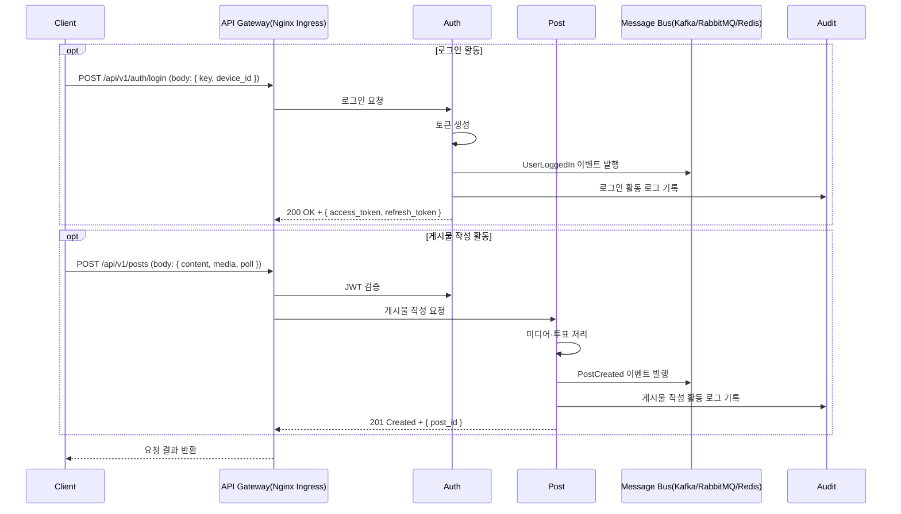

#### 12. 사용자 신고

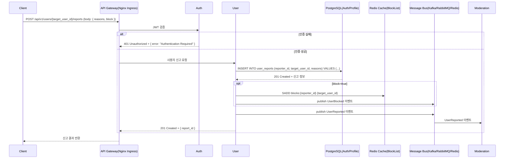

#### 13. 사용자 알림 설정

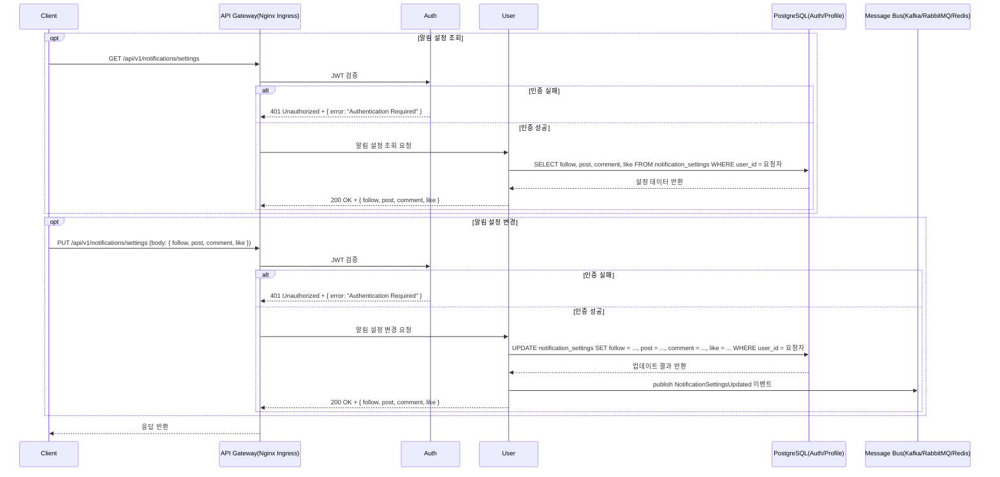

#### 14. 사용자 검색

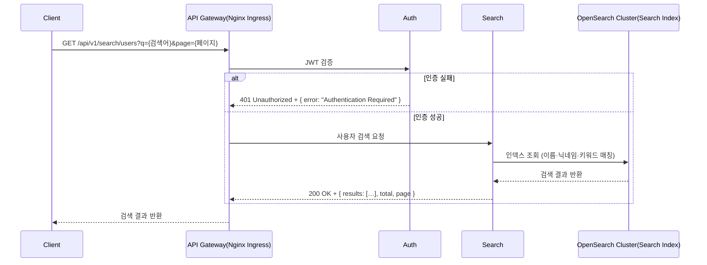

#### 15. 사용자 필터링

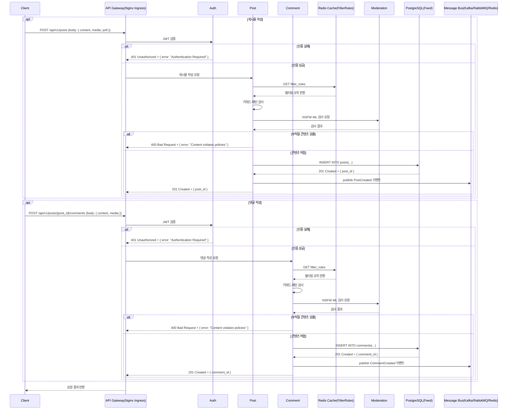
